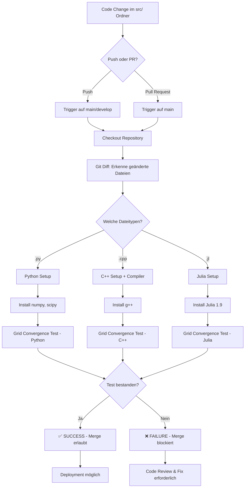
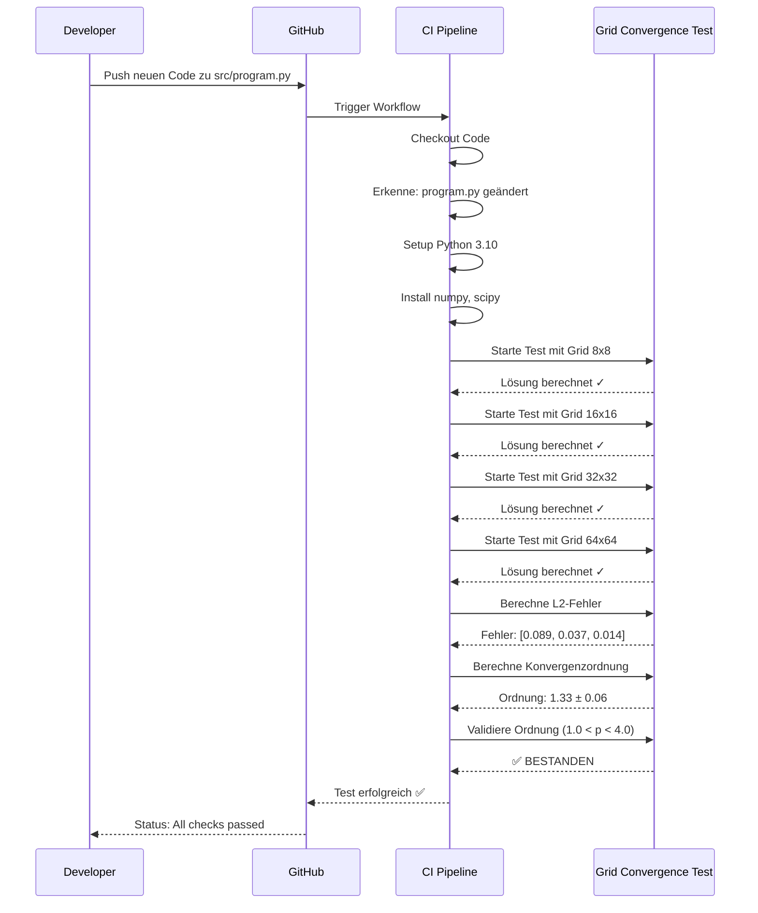

# CI/CD Pipeline Übersicht

## 🔄 Pipeline Workflow



## 📊 Test-Ablauf im Detail



## 🎯 Automatische Validierung pro Datei

```
src/
├── program.py      → Automatisch getestet bei Änderung
├── program.cpp     → Automatisch getestet bei Änderung
├── program.jl      → Automatisch getestet bei Änderung
├── solver_v2.py    → Automatisch getestet bei Änderung
└── my_algo.cpp     → Automatisch getestet bei Änderung
```

**Jede neue oder geänderte Datei im `src/` Ordner wird automatisch validiert!**

## ⚙️ Konfigurierbare Parameter

In `run_validation.py` und den Helper-Scripts:

```python
# Test-Gittergrößen (in run_*_multi_grids.py)
grid_sizes = [256, 128, 64]

# Test-Zeitschritte (in run_*_multi_steps.py)
time_steps = [16, 32, 64]

# Toleranzen für Vergleiche (in run_validation.py)
rtol = 1e-6  # Relative Toleranz
atol = 1e-6  # Absolute Toleranz
```

## 🚦 Status-Badges

Fügen Sie in Ihre README.md ein:

```markdown

```

## 📈 Metriken

Die Pipeline trackt:
- ✅ Anzahl erfolgreich getesteter Dateien
- ❌ Anzahl fehlgeschlagener Tests
- 📊 Durchschnittliche Konvergenzordnung
- ⏱️ Ausführungszeit pro Test
