# CI/CD Pipeline Übersicht

## 🔄 Pipeline Workflow

```mermaid
graph TD
    A[Code Change im src/ Ordner] --> B{Push oder PR?}
    B -->|Push| C[Trigger auf main/develop]
    B -->|Pull Request| D[Trigger auf main]
    
    C --> E[Checkout Repository]
    D --> E
    
    E --> F[Git Diff: Erkenne geänderte Dateien]
    
    F --> G{Welche Dateitypen?}
    
    G -->|.py| H[Python Setup]
    G -->|.cpp| I[C++ Setup + Compiler]
    G -->|.jl| J[Julia Setup]
    
    H --> K[Install numpy, scipy]
    I --> L[Install g++]
    J --> M[Install Julia 1.9]
    
    K --> N[Grid Convergence Test - Python]
    L --> O[Grid Convergence Test - C++]
    M --> P[Grid Convergence Test - Julia]
    
    N --> Q{Test bestanden?}
    O --> Q
    P --> Q
    
    Q -->|Ja| R[✅ SUCCESS - Merge erlaubt]
    Q -->|Nein| S[❌ FAILURE - Merge blockiert]
    
    R --> T[Deployment möglich]
    S --> U[Code Review & Fix erforderlich]
```



## 📊 Test-Ablauf im Detail

```mermaid
sequenceDiagram
    participant Dev as Developer
    participant GH as GitHub
    participant CI as CI Pipeline
    participant Test as Grid Convergence Test
    
    Dev->>GH: Push neuen Code zu src/program.py
    GH->>CI: Trigger Workflow
    CI->>CI: Checkout Code
    CI->>CI: Erkenne: program.py geändert
    CI->>CI: Setup Python 3.10
    CI->>CI: Install numpy, scipy
    
    CI->>Test: Starte Test mit Grid 8x8
    Test-->>CI: Lösung berechnet ✓
    
    CI->>Test: Starte Test mit Grid 16x16
    Test-->>CI: Lösung berechnet ✓
    
    CI->>Test: Starte Test mit Grid 32x32
    Test-->>CI: Lösung berechnet ✓
    
    CI->>Test: Starte Test mit Grid 64x64
    Test-->>CI: Lösung berechnet ✓
    
    CI->>Test: Berechne L2-Fehler
    Test-->>CI: Fehler: [0.089, 0.037, 0.014]
    
    CI->>Test: Berechne Konvergenzordnung
    Test-->>CI: Ordnung: 1.33 ± 0.06
    
    CI->>Test: Validiere Ordnung (1.0 < p < 4.0)
    Test-->>CI: ✅ BESTANDEN
    
    CI-->>GH: Test erfolgreich ✅
    GH-->>Dev: Status: All checks passed
```



## 🎯 Automatische Validierung pro Datei

```
src/
├── program.py      → Automatisch getestet bei Änderung
├── program.cpp     → Automatisch getestet bei Änderung
├── program.jl      → Automatisch getestet bei Änderung
├── solver_v2.py    → Automatisch getestet bei Änderung
└── my_algo.cpp     → Automatisch getestet bei Änderung
```

**Jede neue oder geänderte Datei im `src/` Ordner wird automatisch validiert!**

## ⚙️ Konfigurierbare Parameter

In `grid_convergence_validator.py`:

```python
# Test-Gitter (kann angepasst werden)
test_grids = [8, 16, 32, 64]

# Konvergenzordnung Schwellenwerte
expected_min_order = 1.0  # Minimum akzeptable Ordnung
expected_max_order = 4.0  # Maximum plausible Ordnung

# Timeout für Programm-Ausführung
timeout=60  # Sekunden
```

## 🚦 Status-Badges

Fügen Sie in Ihre README.md ein:

```markdown

```

## 📈 Metriken

Die Pipeline trackt:
- ✅ Anzahl erfolgreich getesteter Dateien
- ❌ Anzahl fehlgeschlagener Tests
- 📊 Durchschnittliche Konvergenzordnung
- ⏱️ Ausführungszeit pro Test
