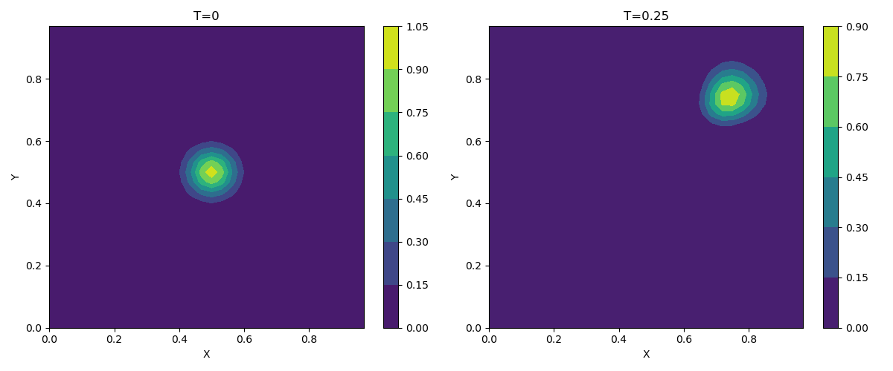
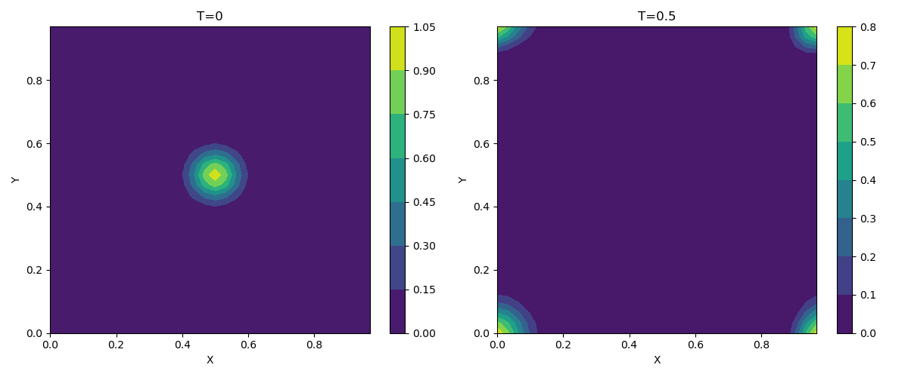
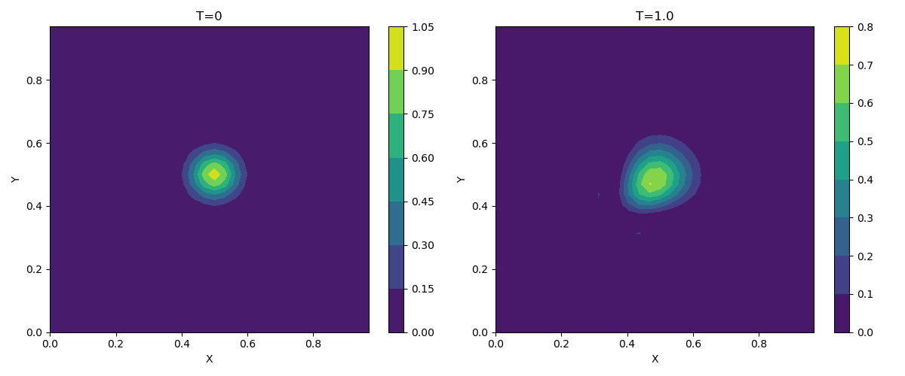

# CodeBench - General Purpose Performance Analyzer# 2D Advection Diffusion solver


A flexible benchmarking tool for comparing Python and C++ program performance.## Project Structure


## 🎯 Features```

01_advDiffSolver/

- ⚡ **General Purpose**: Benchmark any Python and C++ programs├── src/                    # Source code files

- 📊 **Performance Comparison**: Automatic runtime measurement and visualization│   ├── *.py               # Python implementations (any .py file supported)

- 📁 **Flexible Configuration**: Use any config file format your programs need│   ├── *.cpp              # C++ implementations (any .cpp file supported)

- 📈 **Multiple Test Cases**: Support for multiple parameter sets in one config file│   └── *.jl               # Julia implementations

- 💾 **Export Results**: Download results as JSON, CSV, or complete ZIP package├── tests/                  # Test and validation scripts

- 🎨 **Interactive UI**: User-friendly Streamlit web interface│   ├── validate.py

│   ├── validate_grid_convergence.py

## 📁 Project Structure│   ├── validate_grid_convergence_cpp.py

│   └── diagnosetool.py    # Performance diagnosis tool

```├── config/                 # Configuration/input files

CodeBench/│   ├── input.txt          # Single input configuration

├── app.py                 # Streamlit web interface (MAIN ENTRY POINT)│   ├── inputs.txt         # Multiple input configurations

├── tests/│   ├── test_inputs.txt

│   └── diagnosetool.py    # Core benchmark engine│   └── test_multi_grid.txt

├── config/                # Example configuration files├── results/                # Generated results (plots, animations, metrics)

├── results/               # Generated benchmark results│   ├── algorithm_animation.gif

└── src/                   # Example programs│   ├── solution.png

```│   └── all_metrics.json

├── outputs/                # Temporary output files (uEnd.txt, uInit.txt)

## 🚀 Quick Start├── docs/                   # Documentation files

├── img/                    # Static images for README

1. **Start the application:**├── gif_frames/            # Temporary frames for GIF generation

   ```bash├── app.py                 # Streamlit web interface (main entry point)

   streamlit run app.py└── README.md

   ``````


2. **Upload your files:**## Implementation Files

   - Python program (.py)

   - C++ program (.cpp)The system now supports **any filename** for Python (`.py`) and C++ (`.cpp`) files:

   - Configuration file (any format)

- [src/program.cpp](./src/program.cpp) : semi-optimized implementation in C++

3. **Run benchmark and view results!**- [src/program.py](./src/program.py) : Numpy-based implementation in Python, produce also an image with the initial and final 2D fields.

- [src/program.jl](./src/program.jl) : Julia implementation

## 📝 How It Works

You can now use any filename you prefer (e.g., `my_solver.py`, `advection_diffusion.cpp`, etc.).

### Your Programs Should:

## How to run

1. **Read configuration** from a file named `config.txt` in the current directory

2. **Perform computation**### Using the Streamlit Web Interface

3. **(Optional)** Write output files if needed

The application is designed to be used through the Streamlit web interface:

**Example Python program:**

```python```bash

# my_algorithm.pystreamlit run app.py

with open('config.txt', 'r') as f:```

    config = f.read()

    # Parse config and run algorithmThis provides a complete interface for:

    ...- Writing and editing Python/C++ code

```- Configuring benchmark parameters

- Running performance comparisons

**Example C++ program:**- Visualizing results

```cpp- Exporting data

// my_algorithm.cpp

#include <fstream>### Manual Execution (for development)

int main() {

    std::ifstream config("config.txt");📜 _Requires an `input.txt` file to provide the simulation arguments, for instance :_

    // Parse config and run algorithm

    ...```

}512 512

```cross2 circular2 0

0.125 125

### The Tool Will:```


1. Copy your programs and config to a temporary directory- two integers for $N_x$ and $N_y$ (here `512`, `512`)

2. Execute each program once per configuration block- one string for the initialization type (here `cross2`)

3. Measure runtime for both Python and C++ versions- one string for the flow type (here `circular2`)

4. Generate comparison charts and statistics- one float for the diffusion coefficient, or viscosity (here `0`)

- one float for the final time of simulation (here `0.125`)

## ⚙️ Configuration File Format- one integer for the number of time-steps (here `125`)


Your config file can be in **any format** your programs understand:## Base configurations for benchmarking


- Plain text### Simple Gaussian diagonal advection, half time

- JSON

- YAMLInput file :

- CSV

- Custom format```

32 32

### Multiple Test Casesgauss diagonal 0.0

0.25 8

Separate test cases with **blank lines**:```


```Initial and final field (produced by [src/program.py](./src/program.py)) :

# Test Case 1

param1 value1<div style="display: flex; justify-content: center;">

param2 value2    

</div>

# Test Case 2

param1 value3---

param2 value4

Note that if we increase the computation time (and the number of time steps accordingly), we get for

# Test Case 3

param1 value5```

param2 value632 32

```gauss diagonal 0.0

0.5 16

Each block will be run separately, and results will be compared.```


## 📊 Output<div style="display: flex; justify-content: center;">

    

The tool provides:</div><br>


- **Runtime comparison chart** (Python vs C++)and for

- **Detailed results table** with speedup factors

- **JSON export** with complete metrics```

- **CSV export** for further analysis32 32

- **ZIP package** with all resultsgauss diagonal 0.0

1 32

## 🔧 Command-Line Usage```


You can also use the core benchmark tool directly:<div style="display: flex; justify-content: center;">

    

```bash</div>
python tests/diagnosetool.py --py program.py --cpp program.cpp --config config.txt
```

Results will be saved in `results/all_metrics.json` and visualized in `results/runtime_comparison.png`.

## 📦 Requirements

- Python 3.7+
- Streamlit
- Plotly
- Pandas
- Matplotlib
- G++ or Clang (for C++ compilation)

Install dependencies:
```bash
pip install streamlit plotly pandas matplotlib
```

## 💡 Example Use Cases

- Algorithm performance comparison
- Numerical solver benchmarking
- Data processing pipeline comparison
- Scientific computation optimization
- Educational demonstrations of language performance

## 🎓 Notes

- Programs must read from `config.txt` (created automatically by the tool)
- C++ programs are compiled with `-O2` optimization
- Runtime measurement includes I/O operations
- Multiple runs per config ensure cache warm-up

## 📄 License

See LICENSE file for details.

---

**CodeBench v2.0** - General Purpose Benchmark Tool
